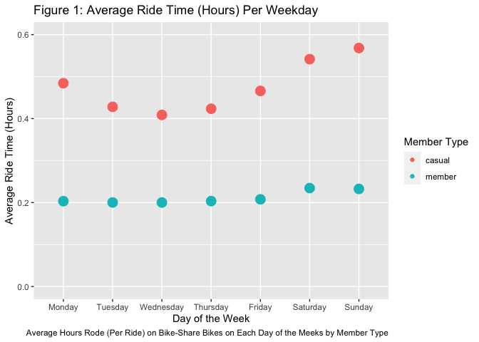
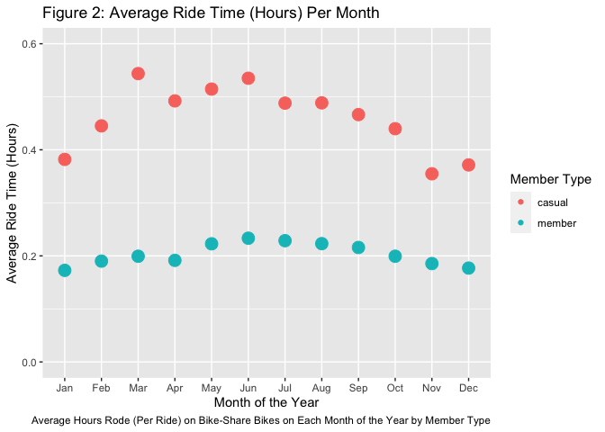
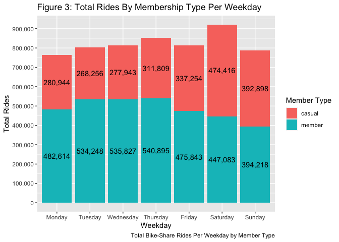
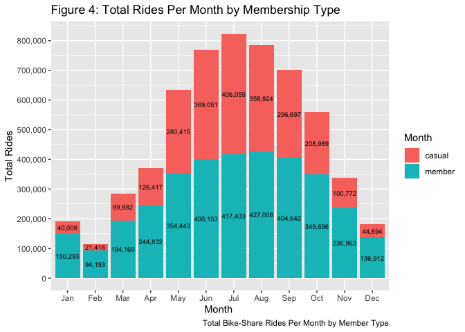
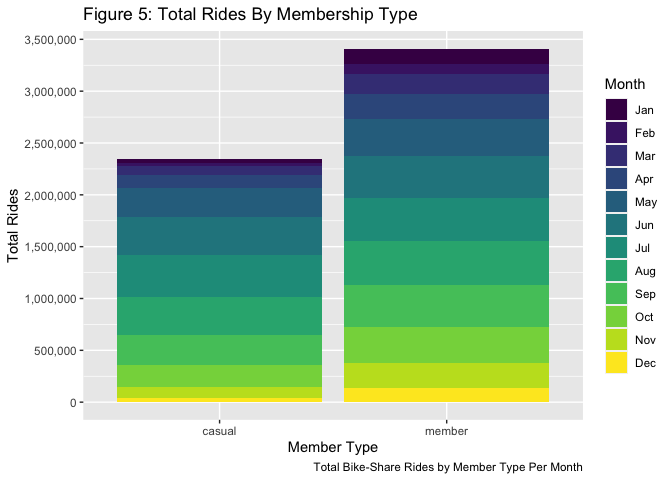

Case Study: How Does a Bike-Share Navigate Speedy Success?
================
Brian Tierney
2023-02-14

# Introduction

## About this Case Study

The data from this case study was provided as part of the capstone
project in the **Google Analytics Professional Certificate Course**. The
premise of this study was given as a fictional scenario working for a
fictional bike share company called Cyclistic Bike-Share. In this
scenario I was given data by the company and asked to generate a report
on how annual members and casual riders differ, why membership may be
attractive to casual users, and how to use advertising and strategy to
improve annual membership numbers to a number of stakeholders.
(Data files used in this report can be found at https://drive.google.com/drive/folders/1pvL5nYz5-NNNqwqHScjXQ9BB9W3kqAZS?usp=share_link )

## Data Introduction

The data given provides information of over 5.75 million ride share
rides from bike share company Cyclistic. In this report I will take in,
narrow down, and analyze this data to try to gain insights to help the
team differentiate annual members and casual riders and give insights
into how riders differ and what might be leading people to buy an annual
membership.

------------------------------------------------------------------------

# Getting And Tidying the Data

## About the Data

This data set from Cyclistic Bike-Share comes in the form of 12 files,
each file representing 1 months worth of data about the ride-share bike
rides that occured during that month. Each files contains 13 variables
that each describe an aspect of a ride on a ride-share bike. Each
variable should be objective and unbiased in its measurement but its
sample is from Chicago from specifically their bike-share service, so it
should not necessarily be used to represent bike-share at large.

## Import Needed Libraries

Importing all the libraries needed for data analysis and visualization.

``` r
library(tidyverse)
library(lubridate)
library(knitr)
library(scales)
```

## Import Data

Import each of the 12 data files provided by Cyclistic (provided as CSV
files) into data frames in R.

``` r
mon1 <- read.csv('Data/202202-divvy-tripdata.csv')
mon2 <- read.csv('Data/202203-divvy-tripdata.csv')
mon3 <- read.csv('Data/202204-divvy-tripdata.csv')
mon4 <- read.csv('Data/202205-divvy-tripdata.csv')
mon5 <- read.csv('Data/202206-divvy-tripdata.csv')
mon6 <- read.csv('Data/202207-divvy-tripdata.csv')
mon7 <- read.csv('Data/202208-divvy-tripdata.csv')
mon8 <- read.csv('Data/202209-divvy-publictripdata.csv')
mon9 <- read.csv('Data/202210-divvy-tripdata.csv')
mon10 <- read.csv('Data/202211-divvy-tripdata.csv')
mon11 <- read.csv('Data/202212-divvy-tripdata.csv')
mon12 <- read.csv('Data/202301-divvy-tripdata.csv')
```

## Combine Data

Upon inspection of all 12 of these data sets all of them share the same
variable names (with the same meaning in the same order) so I combine
them into 1 massive data set to use to have all of the data in 1 place.
This one data set retains all data because it combines the data by rows
that line up together (which is all rows in this case). This method of
joining the data works here because all columns are holding the same
types of data in the same order in all the data sets.

``` r
yearData <- bind_rows(mon1,mon2,mon3, mon4,mon5,mon6,mon7,mon8,mon9,mon10,mon11,mon12)
```

## Clean Data

To Clean the data I first got ride off all columns I didn’t need for my
analysis. I then decided to dropped all rows with Na or missing values
because only roughly .001% of the data was affected and it allows me to
have clean data without missing values while still having a very
representative data set.

``` r
yearData <- yearData %>% select(ride_id,started_at,ended_at,member_casual) %>% drop_na(ride_id,started_at, ended_at, member_casual) 
```

## Summary of Tidied Data For Analysis

After cleaning and tidying all the data I am left 4 columns of data. A
small sample of this data is shown in **Table 1**. In this table you can
see the 4 variables remaining are:

- **Ride ID**: A unique ID generated for each ride.
- **Start Date-Time**: The date and time a user started the ride.
- **End Date-Time**: The date and time a user ended a ride.
- **Member type**: The type of member the user who is riding the bike is
  (either a casual rider (denoted as casual) or an annual member
  (denoted as member)).

``` r
head(yearData) %>%  kable(col.names = c('Ride ID', 'Start Date-Time', 'End Date-Time', 'Member Type'), align = 'ccccccc', caption = 'Table 1: First 6 Lines of Tidyed Cyclistic Rideshare Dataset')
```

|     Ride ID      |   Start Date-Time   |    End Date-Time    | Member Type |
|:----------------:|:-------------------:|:-------------------:|:-----------:|
| E1E065E7ED285C02 | 2022-02-19 18:08:41 | 2022-02-19 18:23:56 |   member    |
| 1602DCDC5B30FFE3 | 2022-02-20 17:41:30 | 2022-02-20 17:45:56 |   member    |
| BE7DD2AF4B55C4AF | 2022-02-25 18:55:56 | 2022-02-25 19:09:34 |   member    |
| A1789BDF844412BE | 2022-02-14 11:57:03 | 2022-02-14 12:04:00 |   member    |
| 07DE78092C62F7B3 | 2022-02-16 05:36:06 | 2022-02-16 05:39:00 |   member    |
| 9A2F204F04AB7E24 | 2022-02-07 09:51:57 | 2022-02-07 10:07:53 |   member    |

Table 1: First 6 Lines of Tidyed Cyclistic Rideshare Dataset

In **Table 2** (below) the reader can see a summary table which
describes each variable and gives some quick statistics when applicable.

``` r
summary(yearData) %>%  kable(col.names = c('Ride ID', 'Start Date-Time', 'End Date-Time', 'Member Type'), align = 'ccccccc', caption = 'Table 2: Summary of Tidyed Cyclistic Rideshare Dataset')
```

|     |     Ride ID      | Start Date-Time  |  End Date-Time   |   Member Type    |
|:----|:----------------:|:----------------:|:----------------:|:----------------:|
|     |  Length:5754248  |  Length:5754248  |  Length:5754248  |  Length:5754248  |
|     | Class :character | Class :character | Class :character | Class :character |
|     | Mode :character  | Mode :character  | Mode :character  | Mode :character  |

Table 2: Summary of Tidyed Cyclistic Rideshare Dataset

------------------------------------------------------------------------

# Analysis

In my analysis I will walk through how I transformed and visualized the
data and give some baseline observations for what I see in this data.

## Transform Data

Here I transformed and summarized the data to generate new insights and
then used those new insights with transformed data to visualize the
data.To go through the steps I took to transform this data starting with
the processed data from before:

1.  I converted both the start date and time to proper date and time
    format (POSIXct).
2.  I created a new variable to represent the elapsed time for each ride
    which takes the difference in time from start to end time and
    returns the time difference in hours.
3.  I created a variable which represents the day of the week the ride
    took place by looking at the day of the week the ride started.
4.  I created a variable that represents the month the ride took place
    by getting the month from the start date of the ride.

``` r
yearData <- yearData %>% mutate(started_at = ymd_hms(started_at)) %>% mutate(ended_at = ymd_hms(ended_at))%>%mutate(ride_time = difftime(ended_at, started_at, units = 'hours')) %>% mutate(ride_wDay = wday(started_at, label = TRUE, abbr = FALSE, week_start = 1)) %>% mutate(month = month(started_at, label = TRUE))
```

## Summarize Data

After transforming the data I then summarized the data in 4 different
ways to gain insights and create visualizations to show those insights.
I summarized in the following ways:

- I summarized for average ride length (in hours) for each day of the
  week and membership status by grouping by the day of the week the ride
  happened and then by the membership type. Then I found the mean ride
  time for each day of the week and membership type combination.
- I summarized for average ride length (in hours) for each month of the
  year and membership status by grouping by the month the ride took
  place the ride happened and then by the membership type. Then I found
  the mean ride time for month and membership type combination.
- I summarized for total rides per day of the week and membership status
  by grouping by the day of the week the ride happened and then by the
  membership type. Then I did a count of total rides with each day of
  the week and member type combination.
- I summarized for total rides based on month of the year and membership
  status by grouping by the month the ride happened and then the
  membership type. Then I counted the total rides for each month of the
  year and membership type combination.

``` r
#Summarize based on day of the week
summedRidesWDay <- yearData %>% group_by(ride_wDay, member_casual) %>% summarize(rideTimes = mean(ride_time))

#Summarize based on the month
summedRidesMon <- yearData %>% group_by(month, member_casual) %>% summarize(rideTimes = mean(ride_time))

#Summarize for Counts of Member vs Casual per month
summedRidesCount <- yearData %>% group_by(member_casual,month) %>% summarize(rideCount = n_distinct(ride_id))

#Summarize for Counts of Member vs Casual per weekday
summedRidesCountDay <- yearData %>% group_by(member_casual,ride_wDay) %>% summarize(rideCount = n_distinct(ride_id))
```

## Visualize Data

I visualized the the average ride time versus day of the week by
membership type in **Figure 1**. As the reader can see there is some
obvious differences in casual rider and annual member habits. Members
ride for around the same elapsed time on pretty much every day, there’s
a small bump on weekends but overall the trend is pretty flat. On the
other hand the casual riders have a significantly more varied time rode
depending on the day of the week. Weekends and the days surrounding them
(so Friday, Saturday, Sunday, and Monday) have significantly higher
average ride time. This suggests the more casual members take longer
rides on the days they are likely more free (in the case of the weekends
and probably Friday as well) and perhaps days where they need or want
some activity to enjoy the city after a long day or week of work. Casual
riders on average take significantly longer rides than members
regardless of day of the week.

``` r
summedRidesWDay %>% ggplot(aes(x = ride_wDay, y = rideTimes)) + geom_point(aes(color = member_casual, size = .2)) + ylim(0, .6) + xlab("Day of the Week") + ylab("Average Ride Time (Hours)") + guides(color = guide_legend(title = "Member Type"), size = "none") + labs(title = "Figure 1: Average Ride Time (Hours) Per Weekday", caption = "Average Hours Rode (Per Ride) on Bike-Share Bikes on Each Day of the Meeks by Member Type")
```

<!-- -->

In **Figure 2** I visualized the average ride time versus the month by
membership type. The reader can see a familiar trend, similar to the one
in **Figure 1**: the riders with annual memberships are much more
consistent over the year with their average ride time than the casual
riders over the year. There is a slight bump in average ride time in the
warmer months of the year but overall the members are pretty consistent.
The casual riders on the other hand see a very different trend. The
spring, summer, and fall see a big jump in average ride time while the
colder winter months see much shorter rides. Again casual riders take
significantly longer rides then members regardless of what month it is.

``` r
summedRidesMon %>% ggplot(aes(x = month, y = rideTimes)) + geom_point(aes(color = member_casual, size = .2)) + ylim(0, .6) + xlab("Month of the Year") + ylab("Average Ride Time (Hours)") + guides(color = guide_legend(title = "Member Type"), size = "none") + labs(title = "Figure 2: Average Ride Time (Hours) Per Month", caption = "Average Hours Rode (Per Ride) on Bike-Share Bikes on Each Month of the Year by Member Type")
```

<!-- -->

In **Figure 3** I visualized the total rides on each weekday for each
membership type. Here, some interesting interesting insights emerge.
During the workweek members dominate the total rides taken. On the
weekends, the totals are much closer with the casual rides outnumbering
the members on Saturday. Overall though, most rides are taken by
members.

``` r
summedRidesCountDay %>% ggplot(aes(x = ride_wDay, y = rideCount,fill = member_casual)) + geom_col(position = "stack") + xlab("Weekday") + ylab("Total Rides")+ guides(fill = guide_legend(title = "Member Type")) + scale_y_continuous(labels = label_comma(),breaks = seq(0, 1000000, by = 100000)) + labs(title = "Figure 3: Total Rides By Membership Type Per Weekday", caption = "Total Bike-Share Rides Per Weekday by Member Type") + geom_text(aes(label = scales::comma(rideCount)), position = position_stack(vjust = .5))
```

<!-- -->

In **Figure 4** I visualized the total rides per month by membership
type. As the reader can see, similar to **Figure 4**, members dominate
the numbers of total rides in most months. The only exceptions being
June, July, and August where the casual riders come much closer to
equaling the annual members in ridership. It’s clear though that annual
members dominate ridership. Another trend which mirrors that of the
**Figure 2** is that in the warmer months people ride more and more
casual riders use the service at that time.

``` r
summedRidesCount %>% ggplot(aes(x = month, y = rideCount, fill = member_casual)) + geom_col(position = "stack") + xlab("Month ") + ylab("Total Rides")+ guides(fill = guide_legend(title = "Month")) + scale_y_continuous(labels = label_comma(), breaks = seq(0, 850000, by = 100000)) + labs(title = "Figure 4: Total Rides Per Month by Membership Type", caption = "Total Bike-Share Rides Per Month by Member Type") + geom_text(aes(label = scales::comma(rideCount)), position = position_stack(vjust = .5), size = 2.5)
```

<!-- -->

In **Figure 5** I’ve decided to “flip” **Figure 4** to show the total
ridership by membership type but with a graphic to show the split of the
totals by month as well. This graphic better shows that the annual
member’s have a significantly higher total ridership than the casual
riders. It also shows how the colder months see significantly less of
the total ridership for both casual and annual members.

``` r
summedRidesCount %>% ggplot(aes(x = member_casual, y = rideCount, fill = month)) + geom_col(position = "stack") + xlab("Member Type") + ylab("Total Rides")+ guides(fill = guide_legend(title = "Month")) + scale_y_continuous(labels = label_comma(), breaks = seq(0, 4000000, by = 500000)) + labs(title = "Figure 5: Total Rides By Membership Type", caption = "Total Bike-Share Rides by Member Type Per Month") 
```

<!-- -->

------------------------------------------------------------------------

# Conclusion

In conclusion, its clear that that there’s significant differences in
ride-share usage between casual riders and annual members. Based on my
analysis I believe I can give some insights and recommend some action
for the board and the marketing team.

## How do annual members and casual riders use Cyclistic bikes differently?

To put it simply annual members are a much bigger part of the user base
and they tend to use the ride-share bikes more often with shorter trips.
To elaborate, annual member’s rides outnumber casual rider’s rides by a
little over a million rides, quite a significant margin. Annual
membership riders are also much more consistent throughout the week and
year round. This indicates just how important annual memberships are to
the company for consistent usage and revenue from the ride-share
service. Casual Riders in contrast are way less consistent. They tend to
ride less on during the working week (Monday through Friday) and outside
of the peak warm months of the year make up a significantly smaller
portion of ridership. However, on weekends and in warmer months of the
year casual riders make up around half of ridership (a much more portion
significant than outside of those times). They also tend to take longer
rides, averaging at or above double average ride length a large portion
of the time.

## Why would casual riders buy Cyclistic annual memberships?

Based on my findings I believe that casual riders would buy an annual
membership for the assumed convenience and cost saving that they could
gain from purchasing the membership. However, given I don’t know the
exact pricing structure of memberships and casual rides that is purely
an assumption. Based on the profile of annual member’s ridership that I
found in my analysis, if a person uses the ride-share bikes very
frequently and for short trips they would fit the profile of a
membership holder. Furthermore, if a casual user is using bike share all
year round they more likely fit into the annual membership profile.

## How could these finding be used to increase annual memberships?

Based on my analysis I have some recommendations for the marketing
team.Firstly, using the profile I’ve described previously, targeted
advertising for annual memberships to those who fit the mold seems like
it could be a great strategy to some convert casual users to annual
members. Emphasizing the benefits of annual membership to those who are
already basically annual members in their behavior should be a perfect
fit because (assuming those people benefit significantly from becoming
annual members) they are very likely to join.Secondly, if the company
wants to catch the most eyes from casual members and the general public
in our more general advertising the company should advertise when most
people are thinking about using and/or using the bikes. The optimal time
periods are going to be on weekends and in the warmer months of the
year. As is evidenced in the visualizations people ride for longer and
in higher numbers (reference **Figure 1** and **Figure 3**) on the
weekends. The effect of the climate is even more drastic when comparing
across the months of the year, as seen in **Figure 2**, **Figure 4**,
and **Figure 5** riders ride for significantly longer and in 10x the
number (compared to the worst months of the year) in the peak summer
months. Therefore in order to capture the greatest number of interested
eyes the company should do more general widespread advertising in those
peak warm months.Lastly, if the company wants to try to improve on the
weaknesses in ridership the company should advertise or strategize to
improve the most in the weakest point in our year. February is by far
the worst month of the year with the ridership numbers dwindling to only
roughly 125,000 rides that months. As shown in **Figure 4** our casual
ridership dwindles extremely low being only a little above 20,000 rides.
If we could improve on this month we would be strengthening our current
greatest weakness.

## Additional Considerations

To conclude I want to add some additional thoughts and considerations
about the data and the analysis. First, I want to say this data is only
from the last 12 months so additional analysis on more historic data may
be beneficial for identifying seasonal trends and ensuring the trends
from the last year are likely to extend into the future. Secondly,
including a user ID with some or all rides could lead to better analysis
of whether annual users really use bikes a lot more than casual users or
not and if so by how much. Lastly, additional analysis on the geographic
data could be done with the addition of more geographic usage metrics
(such as ride length, passing points of interest (possibly via ride path
data), etc) to help understand trends that affect specific areas of
Chicago as well as user behaviors that affect the usage of the
ride-share network.
